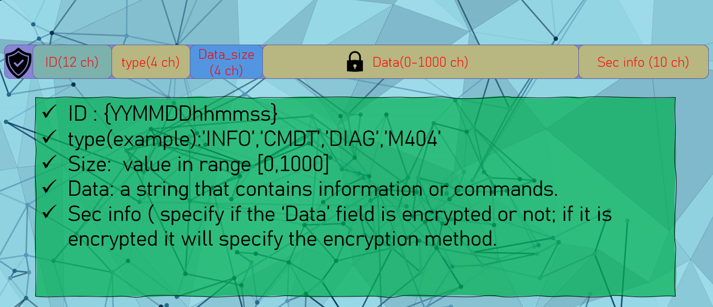
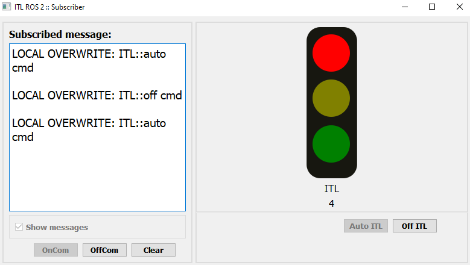
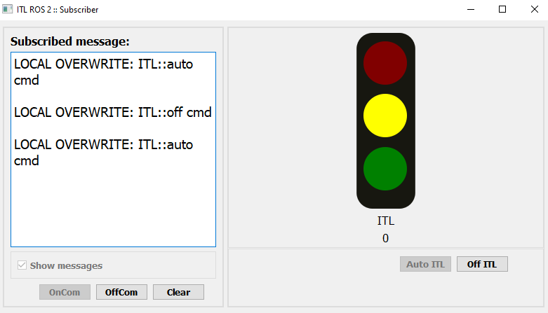
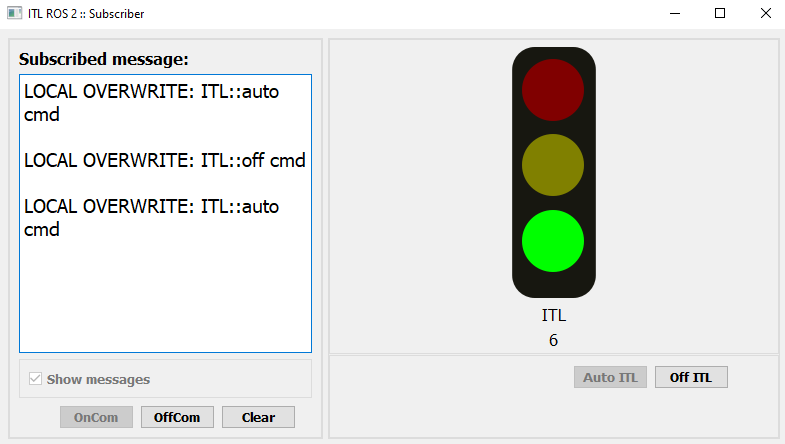
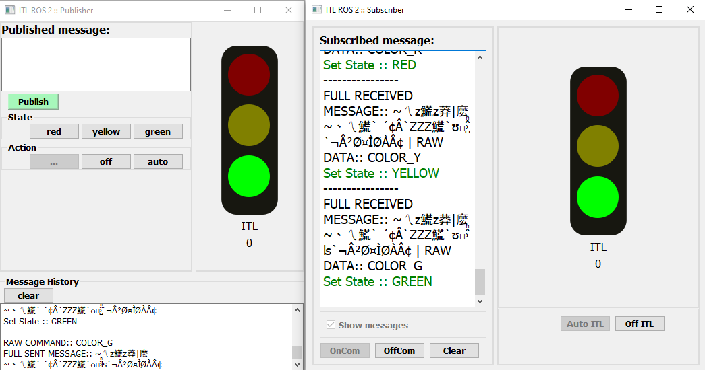

# Intelligent_Traffic_Light_Simulator

This project is written in Python and uses ROS2 for communication architecture. 
   

## The communication architecture (ROS2)
 

  

## The message structure
 

  

## Subscriber node

 

  

 

  

 

  

  
## Publisher and subscriber

 

  

